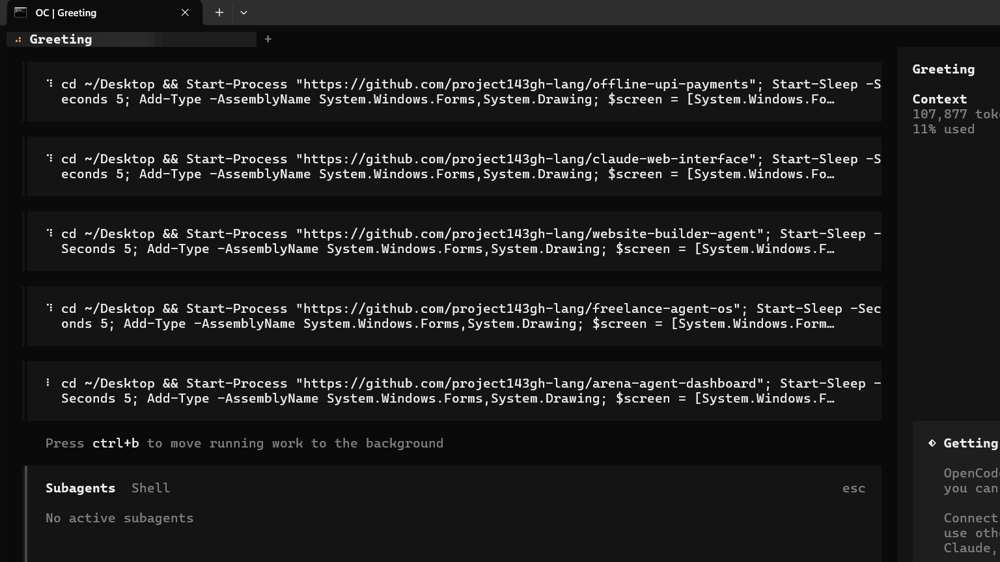

# Offline UPI Payments

A UPI payment system that works without internet connectivity. Send and receive payments offline using secure local vault storage!

## 📸 Screenshot



**Run the system:** Execute `python main.py` in the `UPI_Without_Internet` directory.

## How It Works

This innovative system enables UPI (Unified Payments Interface) transactions **without an active internet connection** by utilizing:

### 🔒 Secure Local Vault
- **Vault keystore** (`vault_keystore.dat`): Encrypted local storage
- **End-to-end encryption**: All transactions encrypted locally
- **Offline transaction generation**: Create UPI payment requests without internet
- **Synchronization**: Sync when internet becomes available

### 💳 Transaction Flow
1. **Generate**: Create payment request offline
2. **Sign**: Local digital signature using vault keystore
3. **Store**: Save transaction in local vault
4. **Sync**: Upload when internet available
5. **Verify**: Server validates and confirms

### 📱 Payment Features
- **QR code generation**: Offline QR code for payments
- **Payment IDs**: Virtual payment address (VPA) management
- **Transaction history**: Local history with timestamps
- **Amount handling**: Rupees, paisa, and all UPI formats
- **Multiple accounts**: Manage multiple UPI IDs

### 📊 Offline Capabilities
- Create payment requests without internet
- View transaction history offline
- Manage UPI IDs locally
- Export data for online sync
- **Cannot**: Validate with bank server, real-time balance check

### 🌐 Online Sync (When Internet Available)
- Server validation of transactions
- Bank balance confirmation
- Transaction finalization
- Dispute resolution
- Multi-device sync

## 🚀 Quick Start

```bash
# 1. Navigate to the offline directory
cd upi2/UPI_Without_Internet

# 2. Run the application
python main.py

# 3. Access the vault interface
# Open your browser to the local URL (usually http://localhost:5000)

# 4. Create your first offline payment
# - Enter amount and UPI ID
# - Generate QR code
# - Save to vault
# - Sync when internet available
```

## 🛠️ Project Structure

```
upi2/
└── UPI_Without_Internet/
    ├── vault_keystore.dat    # Encrypted local vault storage
    ├── main.py               # Main application entry point
    ├── tasks/                # Task management
    │   ├── todo.md           # Daily tasks
    │   └── plan.md           # Strategic planning
    ├── servers/              # Server configurations (for sync)
    │   ├── config.yaml       # Server settings
    │   └── uv.lock           # Unity/Poetry lock file
    └── README.md             # This file
```

## 🛡️ Security Features

### Encryption
- **AES-256**: Vault keystore encryption
- **RSA-2048**: Key exchange security
- **HMAC-SHA256**: Transaction authentication

### Data Protection
- **Local-only storage**: No data leaves your device without explicit sync
- **Encrypted keystore**: vault_keystore.dat requires master password
- **Automatic locking**: Vault locks after inactivity
- **Export controls**: Data export requires authentication

### Privacy
- **No telemetry**: No data sent without consent
- **Anonymous usage**: No personal information collected
- **Opt-in sync**: You choose when to sync

## 📜 License

MIT

---

**K.bhalavardt, MIT Student**